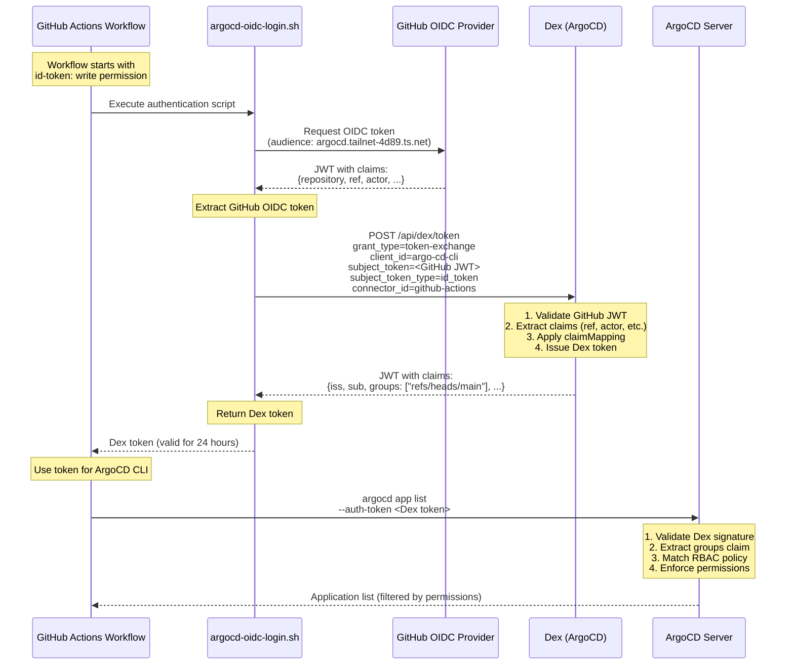

# ArgoCD Authentication for GitHub Actions via OIDC

## Overview

This document describes how we implemented secure, ephemeral authentication for ArgoCD CLI in GitHub Actions workflows using OpenID Connect (OIDC) token exchange through Dex. This eliminates the need for static API tokens while providing branch-based role-based access control (RBAC).

## Problem Statement

### Initial Requirements
- Enable ArgoCD CLI access in GitHub Actions workflows (specifically `claude.yml` and `argocd-diff.yml`)
- Avoid storing static secrets like `ARGOCD_TOKEN`
- Implement branch-based RBAC:
  - Admin access for `main` branch workflows
  - Read-only access for pull request workflows
- Use GitHub Actions' native OIDC workload identity federation
- Tokens should be ephemeral and automatically rotated

### Why Not Direct OIDC?
ArgoCD is configured with Dex as its OIDC provider. While we could theoretically configure ArgoCD to trust GitHub's OIDC provider directly, this would bypass Dex and complicate our authentication architecture. Instead, we use Dex's token exchange capability to bridge GitHub Actions OIDC with ArgoCD.

## Architecture

### Components

1. **GitHub Actions OIDC Provider** (`https://token.actions.githubusercontent.com`)
   - Issues JWT tokens to workflows with workload identity claims
   - Tokens include claims like `repository`, `workflow`, `ref`, `actor`

2. **Dex** (ArgoCD's embedded OIDC provider)
   - Configured with a GitHub Actions OIDC connector
   - Supports OAuth 2.0 token exchange (RFC 8693)
   - Maps GitHub Actions claims to ArgoCD-compatible groups

3. **ArgoCD Server**
   - Validates tokens from Dex
   - Enforces RBAC based on groups claim
   - Provides CLI and API access

4. **Authentication Script** (`.github/scripts/argocd-oidc-login.sh`)
   - Orchestrates the token exchange flow
   - Returns a usable token for ArgoCD CLI commands

### Authentication Flow



### Step-by-Step Flow

1. **GitHub Actions OIDC Token Request**
   ```bash
   curl -H "Authorization: Bearer ${ACTIONS_ID_TOKEN_REQUEST_TOKEN}" \
        "${ACTIONS_ID_TOKEN_REQUEST_URL}&audience=https://argocd.tailnet-4d89.ts.net"
   ```
   - Returns a JWT with claims like:
     ```json
     {
       "repository": "jtcressy-home/infra",
       "ref": "refs/heads/main",
       "actor": "jtcressy",
       "workflow": "Claude Code",
       ...
     }
     ```

2. **Token Exchange with Dex**
   ```bash
   curl -X POST "https://argocd.tailnet-4d89.ts.net/api/dex/token" \
        -H "Content-Type: application/x-www-form-urlencoded" \
        --data-urlencode "client_id=argo-cd-cli" \
        --data-urlencode "client_secret=" \
        --data-urlencode "grant_type=urn:ietf:params:oauth:grant-type:token-exchange" \
        --data-urlencode "subject_token=${GITHUB_OIDC_TOKEN}" \
        --data-urlencode "subject_token_type=urn:ietf:params:oauth:token-type:id_token" \
        --data-urlencode "connector_id=github-actions" \
        --data-urlencode "scope=openid groups email"
   ```

   Key parameters:
   - `client_id=argo-cd-cli`: Uses ArgoCD's existing public CLI client
   - `client_secret=` (empty): Public client doesn't require a secret
   - `subject_token_type=id_token`: Critical - must be `id_token`, not `access_token` or `jwt`
   - `connector_id=github-actions`: Routes to our GitHub Actions OIDC connector

3. **Dex Token Validation and Issuance**
   - Dex validates the GitHub OIDC token against `https://token.actions.githubusercontent.com`
   - Applies `claimMapping` configuration:
     ```yaml
     claimMapping:
       groups: ref  # Maps GitHub's 'ref' claim to 'groups'
     ```
   - Issues a new JWT signed by Dex with ArgoCD-compatible claims

4. **ArgoCD CLI Usage**
   ```bash
   argocd app list \
     --auth-token "${ARGOCD_AUTH_TOKEN}" \
     --server argocd.tailnet-4d89.ts.net \
     --grpc-web
   ```
   - ArgoCD validates the Dex-issued token
   - Extracts `groups` claim: `["refs/heads/main"]`
   - Applies RBAC policy to determine permissions

## Configuration

### Dex Configuration (`argocd-cm.yaml`)

```yaml
dex.config: |
  # Enable token exchange grant type
  oauth2:
    grantTypes:
      - "authorization_code"
      - "refresh_token"
      - "urn:ietf:params:oauth:grant-type:token-exchange"

  connectors:
  - type: oidc
    id: github-actions
    name: GitHub Actions
    config:
      issuer: https://token.actions.githubusercontent.com
      getUserInfo: false  # GitHub Actions OIDC doesn't have userInfo endpoint
      insecureSkipEmailVerified: true
      insecureEnableGroups: true  # Required for groups claim to be included
      scopes:
        - openid
      userIDKey: sub
      userNameKey: actor
      claimMapping:
        groups: ref  # Maps GitHub's 'ref' claim to 'groups' in Dex token
```

**Key Configuration Points:**
- `getUserInfo: false`: GitHub Actions OIDC provider doesn't expose a userInfo endpoint
- `insecureEnableGroups: true`: Forces Dex to include the groups claim even without email verification
- `claimMapping.groups: ref`: Maps the GitHub Actions `ref` claim (e.g., `refs/heads/main`) to the `groups` claim that ArgoCD expects

### RBAC Configuration (`argocd-rbac-cm.yaml`)

```yaml
data:
  scopes: "[email, groups]"  # CRITICAL: Must be 'groups' (plural), not 'group'

  policy.csv: |
    # Branch-based GitHub Actions groups
    g, refs/heads/main, role:gh_actions_main
    g, refs/pull/*, role:gh_actions_pr

    # gh_actions_main role (admin access for main branch)
    p, role:gh_actions_main, applications, *, */*, allow
    p, role:gh_actions_main, repositories, *, *, allow
    p, role:gh_actions_main, clusters, *, *, allow
    p, role:gh_actions_main, projects, *, *, allow
    p, role:gh_actions_main, accounts, *, *, allow
    p, role:gh_actions_main, certificates, *, *, allow
    p, role:gh_actions_main, gpgkeys, *, *, allow

    # gh_actions_pr role (read-only for PRs)
    p, role:gh_actions_pr, applications, get, */*, allow
    p, role:gh_actions_pr, applications, list, */*, allow
    p, role:gh_actions_pr, repositories, get, *, allow
    p, role:gh_actions_pr, repositories, list, *, allow
    p, role:gh_actions_pr, clusters, get, *, allow
    p, role:gh_actions_pr, clusters, list, *, allow
    p, role:gh_actions_pr, projects, get, *, allow
```

**RBAC Behavior:**
- Workflows running on `main` branch: Get admin permissions via `role:gh_actions_main`
- Workflows running on PRs: Get read-only permissions via `role:gh_actions_pr`
- Group matching uses the full `ref` value (e.g., `refs/heads/main`, `refs/pull/123/merge`)

### GitHub Actions Workflow Configuration

```yaml
jobs:
  example:
    runs-on: ubuntu-latest
    permissions:
      id-token: write  # Required for OIDC token request
      contents: read
    steps:
      - uses: actions/checkout@v6

      - name: Connect to Tailscale
        uses: tailscale/github-action@v4
        with:
          oauth-client-id: ${{ vars.TAILSCALE_OAUTH_CLIENT_ID }}
          audience: ${{ vars.TAILSCALE_AUDIENCE }}
          tags: ${{ vars.TAILSCALE_TAGS }}

      - name: Install Task
        uses: go-task/setup-task@v1

      - name: Install ArgoCD CLI
        run: |
          ARGOCD_VERSION=v3.2.1
          curl -sSL -o /usr/local/bin/argocd \
            https://github.com/argoproj/argo-cd/releases/download/${ARGOCD_VERSION}/argocd-linux-amd64
          chmod +x /usr/local/bin/argocd

      - name: Authenticate with ArgoCD
        run: |
          chmod +x .github/scripts/argocd-oidc-login.sh
          ARGOCD_AUTH_TOKEN=$(.github/scripts/argocd-oidc-login.sh)
          echo "ARGOCD_AUTH_TOKEN=${ARGOCD_AUTH_TOKEN}" >> $GITHUB_ENV
        env:
          ARGOCD_SERVER: argocd.tailnet-4d89.ts.net

      - name: Use ArgoCD CLI
        run: |
          argocd app list \
            --auth-token "${ARGOCD_AUTH_TOKEN}" \
            --server argocd.tailnet-4d89.ts.net \
            --grpc-web
```

## Implementation Challenges and Solutions

### Challenge 1: Custom staticClients Not Supported

**Problem:** Initially tried to create a custom Dex staticClient for token exchange, but ArgoCD auto-generates staticClients and doesn't support custom ones.

**Solution:** Reuse the existing `argo-cd-cli` public client that ArgoCD creates. This client is designed for interactive PKCE flows but also works for token exchange.

**Key Insight:** Public clients in Dex (marked with `public: true`) don't require client secrets, but you must still pass an empty `client_secret=` parameter in the token exchange request.

### Challenge 2: Invalid subject_token_type

**Problem:** Initially used `subject_token_type=urn:ietf:params:oauth:token-type:jwt` based on RFC 8693, but Dex rejected it with "Invalid subject_token_type".

**Attempts:**
- `jwt` → 400 error: "Invalid subject_token_type"
- `access_token` → 401 error: "getUserInfo is required for access token exchange"
- `id_token` → ✅ Success

**Solution:** Use `subject_token_type=urn:ietf:params:oauth:token-type:id_token`. GitHub Actions OIDC tokens are ID tokens with embedded claims, not access tokens.

### Challenge 3: Missing Groups Claim

**Problem:** After token exchange succeeded, the Dex token had no `groups` claim, causing ArgoCD to deny access (no RBAC match).

**Root Cause:** The `claimMapping` in the Dex connector wasn't being applied during token exchange.

**Solution:** Add these flags to the Dex connector configuration:
```yaml
getUserInfo: false
insecureSkipEmailVerified: true
insecureEnableGroups: true
```

The `insecureEnableGroups: true` flag forces Dex to include the groups claim even when email isn't verified (which GitHub Actions OIDC tokens don't provide).

### Challenge 4: RBAC Scopes Mismatch

**Problem:** Even with the groups claim present (`"groups": ["refs/heads/main"]`), ArgoCD still returned empty results for `argocd app list`.

**Root Cause:** The RBAC ConfigMap had `scopes: "[email, group]"` (singular) but the token claim was `groups` (plural).

**Solution:** Change RBAC scopes to match the claim name:
```yaml
scopes: "[email, groups]"  # Must be 'groups' (plural)
```

This tells ArgoCD which JWT claims to use when evaluating RBAC policies.

## Token Lifecycle

### Token Expiration
- GitHub Actions OIDC tokens: Valid for the duration of the workflow run
- Dex-issued tokens: 24-hour validity (configured by ArgoCD)
- ArgoCD session: No separate session - tokens are used directly

### Token Validation
1. **GitHub validates** the OIDC token request (workload identity)
2. **Dex validates** the GitHub OIDC token signature against GitHub's JWKS
3. **ArgoCD validates** the Dex token signature against Dex's JWKS

### Token Contents

**GitHub Actions OIDC Token (input):**
```json
{
  "iss": "https://token.actions.githubusercontent.com",
  "sub": "repo:jtcressy-home/infra:ref:refs/heads/main",
  "aud": "https://argocd.tailnet-4d89.ts.net",
  "repository": "jtcressy-home/infra",
  "ref": "refs/heads/main",
  "actor": "jtcressy",
  "workflow": "Claude Code",
  ...
}
```

**Dex Token (output):**
```json
{
  "iss": "https://argocd.tailnet-4d89.ts.net/api/dex",
  "sub": "CixyZXBvOmp0Y3Jlc3N5LWhvbWUvaW5mcmE6cmVmOnJlZnMvaGVhZHMvbWFpbhIOZ2l0aHViLWFjdGlvbnM",
  "aud": "argo-cd-cli",
  "exp": 1764620555,
  "iat": 1764534155,
  "email_verified": true,
  "groups": [
    "refs/heads/main"
  ]
}
```

Note how the `ref` claim from GitHub becomes the `groups` claim in Dex.

## Security Considerations

### Benefits
- **No static secrets**: Tokens are ephemeral and issued per-workflow-run
- **Workload identity**: GitHub validates that the token was issued to our specific repository and workflow
- **Branch-based RBAC**: Fine-grained permissions based on git ref
- **Automatic expiration**: Tokens expire after 24 hours
- **Audit trail**: All token exchanges are logged by Dex and ArgoCD

### Limitations
- **Requires Tailscale**: ArgoCD server must be accessible from GitHub Actions (we use Tailscale)
- **Public client**: The `argo-cd-cli` client has no secret, so anyone can request tokens (but only valid GitHub OIDC tokens are accepted)
- **Trust in GitHub**: We trust GitHub's OIDC provider to validate workload identity

### Defense in Depth
1. GitHub validates the workflow is running in our repository
2. Dex validates the GitHub OIDC token signature
3. ArgoCD validates the Dex token signature
4. RBAC limits what authenticated users can do
5. Tailscale provides network-level access control

## Testing

### Manual Test Workflow
We created `.github/workflows/test-argocd-auth.yml` to validate the authentication flow:

```yaml
on: workflow_dispatch
jobs:
  test-auth:
    permissions:
      id-token: write
      contents: read
    steps:
      - name: Authenticate with ArgoCD
        run: |
          ARGOCD_AUTH_TOKEN=$(.github/scripts/argocd-oidc-login.sh)
          echo "Token claims:"
          echo "$ARGOCD_AUTH_TOKEN" | cut -d. -f2 | base64 -d | jq '.'

      - name: Test ArgoCD API
        run: |
          argocd app list \
            --auth-token "${ARGOCD_AUTH_TOKEN}" \
            --server argocd.tailnet-4d89.ts.net
```

This workflow can be manually triggered to verify:
- Token exchange succeeds
- Token contains correct claims
- ArgoCD accepts the token
- RBAC permissions work

### Troubleshooting

**Token claims inspection:**
```bash
echo "$TOKEN" | cut -d. -f2 | base64 -d | jq '.'
```

**Dex logs:**
```bash
kubectl logs -n argocd deployment/argocd-dex-server --tail=100
```

**ArgoCD server logs:**
```bash
kubectl logs -n argocd deployment/argocd-server --tail=100 | grep -i rbac
```

**Check RBAC policy:**
```bash
kubectl get configmap argocd-rbac-cm -n argocd -o yaml
```

## Production Usage

### claude.yml Workflow
The main Claude Code workflow now uses this authentication:

```yaml
- name: Authenticate with ArgoCD
  run: |
    chmod +x .github/scripts/argocd-oidc-login.sh
    ARGOCD_AUTH_TOKEN=$(.github/scripts/argocd-oidc-login.sh)
    echo "::add-mask::${ARGOCD_AUTH_TOKEN}"
    echo "ARGOCD_AUTH_TOKEN=${ARGOCD_AUTH_TOKEN}" >> $GITHUB_ENV
  env:
    ARGOCD_SERVER: argocd.tailnet-4d89.ts.net

- name: Run Claude Code
  uses: anthropics/claude-code-action@v1
  with:
    anthropic_api_key: ${{ secrets.ANTHROPIC_API_KEY }}
    claude_args: |
      --allowed-tools "Bash(git:*),Bash(gh pr create:*),Bash(task:*),Bash(argocd:*),Bash(kubectl:*)"
```

Claude Code can now execute `argocd` and `kubectl` commands with proper authentication and authorization.

### argocd-diff.yml Workflow
Pull request diff workflow uses the same authentication with read-only permissions:

```yaml
- name: Authenticate with ArgoCD
  run: |
    chmod +x .github/scripts/argocd-oidc-login.sh
    ARGOCD_AUTH_TOKEN=$(.github/scripts/argocd-oidc-login.sh)
    echo "ARGOCD_AUTH_TOKEN=${ARGOCD_AUTH_TOKEN}" >> $GITHUB_ENV

- run: task apps:overlays:diff-pr-all -- --grpc-web
  env:
    ARGOCD_SERVER: argocd.tailnet-4d89.ts.net
```

## References

- [RFC 8693: OAuth 2.0 Token Exchange](https://datatracker.ietf.org/doc/html/rfc8693)
- [Dex Token Exchange Guide](https://dexidp.io/docs/guides/token-exchange/)
- [Dex OIDC Connector](https://dexidp.io/docs/connectors/oidc/)
- [GitHub Actions OIDC](https://docs.github.com/en/actions/deployment/security-hardening-your-deployments/about-security-hardening-with-openid-connect)
- [ArgoCD RBAC](https://argo-cd.readthedocs.io/en/stable/operator-manual/rbac/)
- [ArgoCD User Management](https://argo-cd.readthedocs.io/en/stable/operator-manual/user-management/)

## Future Improvements

1. **Token caching**: For workflows with multiple steps, cache the token to avoid repeated exchanges
2. **Token refresh**: Implement refresh token flow for long-running workflows (>24 hours)
3. **Multiple clusters**: Extend to support ArgoCD instances in multiple clusters
4. **Granular RBAC**: Add more fine-grained permissions per-application or per-project
5. **Audit logging**: Enhanced logging of all authenticated actions

## Conclusion

This implementation provides secure, ephemeral authentication for ArgoCD CLI in GitHub Actions without requiring static secrets. The token exchange flow leverages GitHub's native OIDC workload identity, Dex's federation capabilities, and ArgoCD's RBAC to provide branch-based access control.

Key success factors:
- Using the existing `argo-cd-cli` public client instead of custom clients
- Correct `subject_token_type` (`id_token` not `access_token`)
- Enabling groups claim via `insecureEnableGroups: true`
- Matching RBAC scopes to claim names (`groups` not `group`)

The result is a maintainable, secure authentication system that integrates seamlessly with GitOps workflows.
